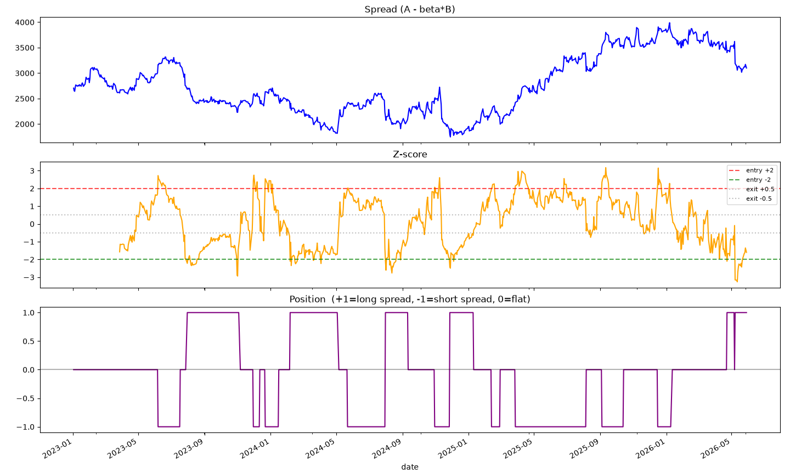

# statarb-engine

A modular backtesting engine for statistical arbitrage (pairs trading) on futures.

Drop a folder of futures CSVs in, define sector groupings, and it screens every within-sector pair for cointegration, generates z-score signals, and backtests them under three validation regimes, with look-ahead bias structurally prevented and enforced by tests.

Nothing is market-specific. Any CSV of dated bars works.

```
raw bars → data_layer → create_pairs → cointegration → zscore_signal → engine → evaluate → portfolio/report
```

Each stage is independent. Swap the hedge ratio estimator, the signal rule, or the cost model without touching anything else.

---

## 1. Data layer

Put your CSVs in **`data/`**, one file per ticker. **The filename is the ticker** (`XOM.csv` → `XOM`).

**Required columns:** `Date`, `Time`, `Close`, `Volume`. Anything else is ignored.

```
Date,Time,Open,High,Low,Close,Volume
02/01/2023,09:30:00,110.05,110.42,109.88,110.21,42000
02/01/2023,09:31:00,110.21,110.55,110.10,110.48,38000
```

**`Date` must be `dd/mm/yyyy`**, `Time` must be `HH:MM:SS`.

**Any bar size works.** `data_layer.py` groups every row by date, takes the **last `Close` of each day**, and stitches all tickers into one panel:

```
                 XOM      CVX      JPM
2023-01-02    110.21   150.44   145.80
2023-01-03    111.05   151.02   144.15
```

Rows = dates, cols = tickers, values = daily close. That panel is what every downstream module consumes.

```python
close = load_panel(FOLDER, tickers=["XOM", "CVX"])          # daily
close = load_panel(FOLDER, tickers=[...], freq="1h")        # hourly
```

`freq` aggregates coarser than your source bars, never finer. 1-minute input can produce any frequency; daily input can only produce daily.

### No data?

```bash
python3 make_mock_data.py
```

Generates synthetic tickers into `data/` in the correct format, with a **known planted answer**: five cointegrated pairs with chosen betas and half-lives, plus 24 independent random walks. The screen must find the first group and reject the second. Enough to run the whole pipeline and the test suite with no market data at all.

---

## 2. Pair generation

`candidate_pairs/create_pairs.py`. `all_pairs()` returns every pair to be
tested for cointegration. Add tickers to be tested here.

By default it holds a sector map and enumerates every within-sector
combination. A sector of 7 tickers yields C(7,2) = 21 pairs.

```python
SECTORS = {
    "energy":   ["XOM", "CVX", "COP", "SLB"],
    "banks":    ["JPM", "BAC", "WFC", "C"],
    "payments": ["V", "MA", "AXP"],
}
```

No filtering happens here, it produces candidates, nothing more.

---

## 3. Cointegration screening

`candidate_pairs/cointegration.py`, the statistical core.

**Hedge ratio: scale-corrected TLS.** β is estimated by total least squares, via the first principal component of the _standardized_ covariance matrix.

- _Why not OLS:_ it minimizes vertical distance, treating B as noise-free. Both legs are noisy, and the result is **asymmetry**: `β(A,B) ≠ 1/β(B,A)`, so which stock you arbitrarily call "A" changes the spread you trade. TLS is symmetric.
- _Why standardize:_ PCA is not scale-invariant. A stock at $430 has ~13× the dollar wobble of one at $32 even with identical economic noise, so it dominates the covariance matrix on price level alone and drags the fitted axis toward vertical. Divide each leg by its own std, rescale the slope by `std(A)/std(B)` after.

**Four filters, on the formation window only:**

|     | rule                   | rejects                                                     |
| --- | ---------------------- | ----------------------------------------------------------- |
| 1   | `len(formation) ≥ 100` | insufficient history                                        |
| 2   | `\|corr(A,B)\| ≥ 0.5`  | legs that don't move together                               |
| 3   | `beta > 0`             | negative β gives `A + \|β\|·B`, long _both_ legs, not a spread |
| 4   | `coint p-value < 0.05` | spreads that are random walks                               |

**Order matters.** Filters 2 and 3 run _before_ the cointegration test, because `hedge_ratio()` will fit a β to two unrelated series and the test will score the resulting nonsense spread. Neither errors out.

**The test.** `cointegration_pvalue()` routes to `statsmodels.tsa.stattools.coint`, Engle-Granger with **Phillips-Ouliaris critical values**.

This matters: running `adfuller()` on a residual whose β you fitted by minimizing that same residual's variance is miscalibrated. `adfuller`'s critical values assume the series was handed to it, not that you first searched for the most stationary-looking combination. Phillips-Ouliaris is derived for exactly this case. Set `USE_ENGLE_GRANGER = False` to compare against the naive path.

`half_life()` reports `-ln(2)/θ`, how many bars the spread takes to close half its gap.

---

## 4. Signal

`backtest/zscore_signal.py`. The spread is normalized into a rolling z-score, so every pair speaks the same language regardless of price scale:

```
z = (spread − rolling_mean) / rolling_std
```

| z                        | meaning               | position                |
| ------------------------ | --------------------- | ----------------------- |
| `z < −ENTRY`             | A cheap relative to B | **+1** long the spread  |
| `z > +ENTRY`             | A rich relative to B  | **−1** short the spread |
| `\|z\|` near 0           | reverted              | **0** flat              |
| `\|z\|` past `STOP_LOSS` | diverged instead      | **0** stop out          |



Because the z-score divides by the spread's own standard deviation, **it is scale-free**. Thresholds never need retuning when β or the price level changes. (Asserted in the test suite.)

### A worked trade

`XOM` / `CVX`, with `β = 0.70` fitted on the formation window. `ENTRY = 2.0`, `EXIT = 0.5`. Rolling mean of the spread is 0.0, rolling std is 2.0.

| date  | XOM    | CVX    | `spread = XOM − 0.70·CVX` | `z`      | signal               | position held            |
| ----- | ------ | ------ | ------------------------- | -------- | -------------------- | ------------------------ |
| Mar 3 | 110.00 | 155.00 | 1.50                      | 0.75     |                      | flat                     |
| Mar 4 | 113.50 | 155.20 | **4.86**                  | **2.43** | **−1**, XOM is rich  | flat                     |
| Mar 5 | 113.80 | 155.00 | 5.30                      | 2.65     | −1                   | **−1** ← _entered here_  |
| Mar 6 | 112.00 | 156.00 | 2.80                      | 1.40     | −1                   | −1                       |
| Mar 7 | 110.50 | 156.50 | 0.95                      | **0.48** | **0**, reverted      | −1                       |
| Mar 8 |        |        |                           |          | 0                    | **flat** ← _exited here_ |

**The signal fires on Mar 4. The position opens on Mar 5.** That one-bar gap is `positions.shift(1)`. You can't trade on a bar you haven't seen close yet.

Notice what it costs: the spread widened _further_ overnight (4.86 → 5.30), so the first day of the trade is a loss. A backtest without the shift would have entered at 4.86 and pocketed that move for free, which is exactly why look-ahead bias makes results look spectacular.

Shorting the spread means **short 1 XOM, long 0.70 CVX**. P&L accrues as `position[t−1] × Δspread[t]`:

```
Mar 5   −1 × (5.30 − 4.86) =  −0.44      spread widened, losing
Mar 6   −1 × (2.80 − 5.30) =  +2.50      reverting
Mar 7   −1 × (0.95 − 2.80) =  +1.85      reverting
                             ──────
                   gross      +3.91
       costs  2 changes × 0.05  −0.10
                             ──────
                     net      +3.81
```

The bet was never on XOM or CVX going up or down. It was on the **gap between them closing**, and it did.

---

## 5. Backtest engine

```python
gross_pnl = positions.shift(1) * spread.diff()
costs     = positions.diff().abs() * COST_PER_UNIT
net_pnl   = gross_pnl - costs
```

`backtest_pair_loop()` ships as an explicit, obviously-correct reference implementation. The test suite asserts the vectorized version equals it exactly.

---

## 6. Config, single source of truth

`backtest/config.py` is the **only** place these are defined:

```python
MODE             = "rolling"     # "full" | "split" | "rolling"
WEIGHT_SCHEME    = "equal_risk"  # "equal_weight" | "equal_risk"
COST_PER_UNIT    = 0.05
FORMATION_MONTHS = 24            # rolling: trailing window used to fit
STEP_MONTHS      = 3             # rolling: months traded before re-fitting
```

Every script imports from here. Duplicating `MODE` across `run_all_pairs`, `portfolio`, and `report` causes a silent failure where all three modes appear to work but display the same stale results. Output filenames are keyed on `MODE`, so results never collide.

---

## 7. Three validation modes

Optimistic to honest. All three share the same `_fit()` gate, so tradeability rules can't drift apart between them.

**`full`** fits β and trades on **all** the data.

In-sample, and it will always look best: the pair was selected using the same data it's scored on, and β was fitted on the very bars it then trades. P&L and Sharpe come out substantially inflated. It's here as a **diagnostic ceiling**, not a result. If a pair can't make money even in-sample, the problem isn't overfitting, it's the signal logic. Use it to confirm the plumbing works, then ignore the number.

**`split`** fits β and tests cointegration before `SPLIT_DATE`, then trades everything after **once**, with β frozen. The trading period never influenced pair selection or the hedge ratio.

**`rolling`** walks forward:

```
formation (trailing 24mo)      trade (3mo)
├────────────────────────┤     ├────┤
     ├────────────────────────┤     ├────┤
          ├────────────────────────┤     ├────┤
```

Re-test cointegration on the **trailing** window, re-fit β, freeze it, trade forward, step, stitch the P&L. A pair failing the gate sits out that quarter and can re-qualify later, which is what a live desk would do. The window is genuinely trailing, not expanding.

```python
run_rolling(close, a, b, formation_months=12, step_months=3)   # override per-call
```

---

## 8. Portfolio and reporting

`portfolio.py` combines per-pair P&L. `equal_risk` weights by inverse volatility measured **only on bars where the pair held a position**, not on the zeros padded in while it was gated out, which would read "flat because idle" as "low risk" and lever it up.

`report.py` writes a summary table, equity curve, and monthly returns heatmap to `results/report_{MODE}_{WEIGHT_SCHEME}.png`.

---

## 9. Verification

`verification_scripts/verify_pipeline.py`, **33 property-based assertions.**

Bugs that matter in a backtester don't throw exceptions. They produce a plausible number. So the suite asserts properties that _must_ hold, not "it ran":

- **known-answer**: plant β = 3, the estimator must recover 3. Plant β = 50 with a 50× price gap, must recover 50.
- **symmetry**: `β(A,B) == 1/β(B,A)`
- **scale**: scale A by 10× and β scales 10×; scale B by 10× and β scales 1/10
- **gating**: two independent random walks must be _rejected_, not merely scored badly
- **z-score invariance**: `zscore(1000·spread) == zscore(spread)`
- **no look-ahead**: vectorized equals explicit loop; `gross_pnl[t] == positions[t-1]·Δspread[t]`; **and must NOT** equal `positions[t]·Δspread[t]`
- **trailing window**: 12mo and 24mo formation must give _different_ results. If the window were expanding, they'd coincide.

```bash
python3 -m verification_scripts.verify_pipeline    # exit 0 pass, 1 fail, CI-ready
```

**Diagnostics** (read-only):

| script                      | shows                                                                |
| --------------------------- | -------------------------------------------------------------------- |
| `hedge_ratio_diagnostic.py` | covariance matrix, principal eigenvector, β under three estimators   |
| `adf_screen_dump.py`        | every pair's p-value, the distribution, Bonferroni / BH-FDR verdicts |
| `adf_calibration_check.py`  | `adfuller()` vs `coint()`, both p-value histograms                   |
| `rolling_window_audit.py`   | per-window universe, churn between quarters, weights vs days traded  |
| `frequency_sweep.py`        | p-value distribution at 1D vs 1h, _before_ building any backtest      |

**On multiple testing.** The screen tests hundreds of pairs at `p < 0.05`. At a 5% false-positive rate, ~1 in 20 random walks passes by chance: test 215 pairs and ~11 clear the bar even if nothing is cointegrated. The engine applies no correction by default. `adf_screen_dump.py` reports Bonferroni and BH-FDR verdicts alongside the raw threshold, and anyone screening a large universe should look at this before trusting a pair count.

---

## Running it

```bash
python3 -m venv venv && source venv/bin/activate
pip install pandas numpy statsmodels matplotlib seaborn
```

Put data in `data/` (or run `python3 make_mock_data.py`), edit `SECTORS`, set `MODE` in `config.py`, then **from the repo root**:

```bash
python3 -m backtest.run_all_pairs && python3 -m backtest.portfolio && python3 -m backtest.report
```

Everything runs as a module (`-m`). Direct file-path execution breaks relative imports.

---

## Known limitations

- **Transaction costs are a placeholder.** `COST_PER_UNIT` is charged per unit of position change, with no bid-ask, slippage, or market impact. Pairs trading is high-turnover, so set this seriously before trusting any Sharpe.
- **Survivorship bias.** The universe is whatever is in your data folder today.
- **Position sizing is fixed-share-ratio**, based on formation-period β, not strictly equal-dollar as prices drift.
- **Portfolio-level beta-to-market is not computed.** `evaluate.py` reports it per-pair; running it on the aggregate equity curve would show whether the book is genuinely market-neutral.

---

## Layout

```
data/                          your CSVs go here (gitignored)
make_mock_data.py              synthetic data with a known planted answer
data_layer.py                  bars → daily price panel
candidate_pairs/
  create_pairs.py              sector map → candidate pairs
  cointegration.py             TLS hedge ratio, gate, Engle-Granger, half-life
backtest/
  config.py                    single source of truth
  zscore_signal.py             z-score → {-1, 0, +1}
  engine.py                    t+1 P&L, costs, equity
  validation_methods.py        run_full / run_split / run_rolling
  evaluate.py                  Sharpe, Calmar, max drawdown, beta-to-market
  run_all_pairs.py             screen + backtest every candidate
  portfolio.py                 weighting, aggregation
  report.py                    summary table, equity curve, monthly heatmap
verification_scripts/          33 property tests + 5 diagnostics
docs/                          signal walkthrough, worked examples
```
